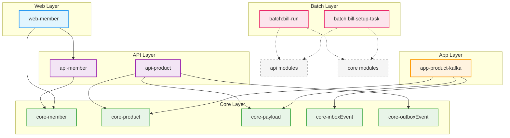

## `spring-template` 프로젝트 모듈 의존성 분석 (Markdown)

`spring-template` 프로젝트는 여러 하위 모듈로 구성되어 있으며, 각 모듈은 특정 책임과 기능을 담당합니다. `settings.gradle` 파일, 각 모듈의 `build.gradle` 파일, 그리고 `README.md` 문서들을 통해 모듈 간의 의존 관계를 분석한 결과는 다음과 같습니다.

### 1. 전체 모듈 목록

`settings.gradle` 파일에 정의된 모듈은 다음과 같습니다:

*   `core:core-member`
*   `core:core-product`
*   `core:core-outboxEvent`
*   `core:core-payload`
*   `core:core-inboxEvent`
*   `api:api-member`
*   `api:api-product`
*   `app:app-product:app-product-kafka` (이하 `app-product-kafka`로 지칭)
*   `web:web-member`
*   `batch:bill-run`
*   `batch:bill-setup-task`

### 2. 모듈별 의존성 상세

#### 2.1. `core` 계열 모듈

`core` 모듈들은 도메인의 핵심 로직, 엔티티, 공통 데이터 구조 등을 정의하며, 일반적으로 다른 계층(api, app, web)에 의존하지 않고, 오히려 다른 모듈들에게 의존되는 기반 역할을 합니다.

*   **`core-member`**:
    *   다른 프로젝트 모듈에 대한 명시적인 의존성은 확인되지 않았습니다.
*   **`core-product`**:
    *   다른 프로젝트 모듈에 대한 명시적인 의존성은 확인되지 않았습니다.
*   **`core-outboxEvent`**:
    *   다른 프로젝트 모듈에 대한 명시적인 의존성은 확인되지 않았습니다.
*   **`core-payload`**:
    *   다른 프로젝트 모듈에 대한 명시적인 의존성은 확인되지 않았습니다.
*   **`core-inboxEvent`**:
    *   다른 프로젝트 모듈에 대한 명시적인 의존성은 확인되지 않았습니다.

#### 2.2. `api` 계열 모듈

`api` 모듈들은 비즈니스 로직과 데이터 영속성 처리를 담당하며, `core` 모듈에 의존합니다.

*   **`api-member`**:
    *   **의존하는 모듈:**
        *   `core-member`
*   **`api-product`**:
    *   **의존하는 모듈:**
        *   `core-product`
        *   `core-payload`
        *   `core-outboxEvent`

#### 2.3. `app` 계열 모듈

`app` 모듈들은 외부 시스템과의 연동을 담당하며, 주로 `core` 모듈이나 경우에 따라 `api` 모듈에 의존할 수 있습니다.

*   **`app-product-kafka`**:
    *   **의존하는 모듈:**
        *   `core-product`
        *   `core-payload`
        *   `core-inboxEvent`

#### 2.4. `web` 계열 모듈

`web` 모듈들은 RESTful API 엔드포인트를 제공하며, `api` 모듈에 의존하여 비즈니스 로직을 호출합니다.

*   **`web-member`**:
    *   **의존하는 모듈:**
        *   `core:core-member`
        *   `api:api-member`

#### 2.5. `batch` 계열 모듈

`batch` 모듈들은 배치 처리를 담당합니다.

*   **`batch:bill-run`**
*   **`batch:bill-setup-task`**
    *   이 모듈들의 `build.gradle` 파일이 제공되지 않아 직접적인 의존성은 확인할 수 없습니다.
    *   일반적으로 배치 작업의 성격에 따라 데이터를 처리하기 위해 `api` 모듈의 서비스를 호출하거나, `core` 모듈의 엔티티 및 리포지토리를 직접 사용할 수 있습니다.

